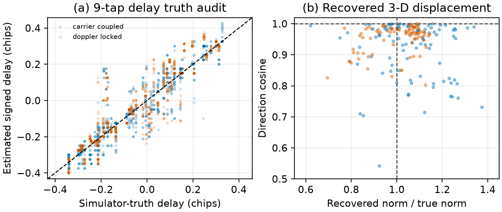

# CGC formula and signed-delay accuracy audit v1

## Purpose and boundary

This audit asks whether the two quantitative links used by CGC are accurate on
the retained `cgc-temporal-final-static-v1` receiver--RF campaign:

1. whether the exact per-PRN simulator code-range difference follows the
   first-order LOS law, and
2. whether the complex nine-tap estimator recovers that signed delay closely
   enough for the geometry test.

It is a post-hoc descriptive audit of the already frozen five-geometry static
campaign. It is not a new independent detection test, does not refit a
threshold, and does not turn the simulated RF cases into field measurements.

## Result

The result is **supportive**. All five descriptive checks in the executable
audit passed.

### LOS law against exact range truth

For 11,160 held-out truth rows after the carry-off hold began, the exact
counterfeit-minus-authentic code-range difference was compared with

\[
\delta_i^{\rm lin}=-\mathbf u_i^{\mathsf T}\mathbf d/L_{\rm chip}.
\]

The LOS vector was intentionally fixed to the startup value used by CGC, so
the discrepancy conservatively includes both first-order range approximation
and up to 30 s of LOS aging.

| Metric | Result |
|---|---:|
| MAE | 0.000432 chip (0.127 m) |
| RMSE | 0.000513 chip |
| Maximum absolute error | 0.001416 chip (0.415 m) |

This error is far below the estimator dictionary step of 0.025 chip. The
range/LOS approximation is therefore not the dominant error source in these
100 m, 30 s static experiments.

### Nine-tap signed-delay truth audit

The exact per-PRN component code-range difference was compared with 1,966
one-second receiver estimates from the carrier-coupled and authentic-Doppler-
locked conditions. Sign accuracy is evaluated only when
\(\lvert\delta\rvert\geq0.05\) chip.

| Quantity | Raw 1-s estimate | Causal 5-bin median |
|---|---:|---:|
| MAE | 0.0714 chip | **0.0556 chip** |
| RMSE | 0.1077 chip | **0.0821 chip** |
| Bias | 0.00593 chip | **0.00577 chip** |
| Pearson correlation | 0.864 | **0.916** |
| Sign accuracy | 90.43% | **93.48%** |

Clock-centering the stabilized estimates gives 0.0553-chip MAE and
0.0787-chip RMSE. Hence the nuisance clock term does not conceal a material
common bias. The remaining approximately 0.056-chip MAE is about 16.3 m: it is
adequate for the cross-satellite 100 m pattern tested here, but it is not a
claim of navigation-grade ranging accuracy.

### End-to-end three-dimensional recovery

The same WLS implementation used by CGC was applied to 180 stabilized
pair/condition/second fits.

| Metric | Median |
|---|---:|
| Direction cosine with the true displacement | **0.9668** |
| Absolute displacement-norm relative error | **9.00%** |
| Three-dimensional vector error | 30.25 m |
| Clock-centered geometry residual | 0.0934 |

The direction and norm results support the intended use: CGC tests whether a
shared displacement direction explains the PRN delays. The vector error also
shows why the fitted displacement should not be presented as a precise
navigation solution.

## Interpretation for the WCL manuscript

The audit supports a narrow statement: in the frozen 25 MHz simulated-I/Q
receiver chain, the first-order LOS equation closely matches exact code-range
truth, and the causal nine-tap estimator preserves the signed cross-satellite
delay pattern with measurable error. It does not establish a universal
front-end-independent accuracy bound.

Because the letter is already at the five-page limit, the defensible minimal
manuscript change is one compact result sentence rather than a new figure.
The full audit figure and metrics remain in this repository.



## Reproduction

```bash
PYTHONPATH=src .venv/bin/python scripts/audit_cgc_formula_accuracy_v1.py
```

Canonical outputs:

- `docs/results/cgc_formula_accuracy_audit_v1_summary.json`
- `docs/results/figures/cgc_formula_accuracy_audit_v1.png`
- `docs/results/figures/cgc_formula_accuracy_audit_v1.pdf`
